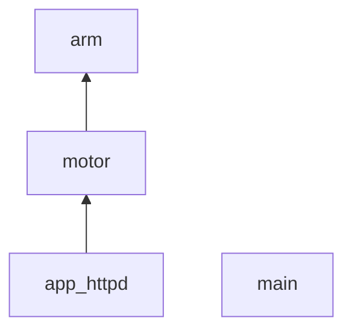
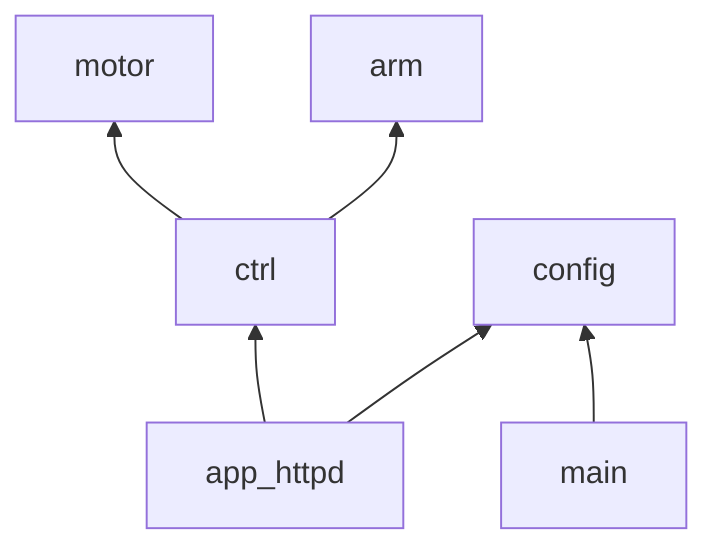

# ESP32-CAM Arduino
This is a branch of the project starting from the ESP32-CAM example project, it was built targeting an ESP32S3N8R8 using the arduino IDE selecting "ESP32S3 Dev Module" from the boards list.

Additional libraries will be needed.

## Planned changes

### Config file for defaul WiFi
Using this include pattern to include a `xxx.env.h` file.

```c++
#if __has_include("primary_file.h")
    #include "primary_file.h"
#else
    #include "fallback_file.h"
#endif
```

### Make control primary
Currently control is embedded with the code to acually drive the hardware, this should be seperated so the same motor code can be used in other parts of this repo (platform.io side).



---




### Updating the Arm
The initial version of the arm was based off a (six-axis project using SG90)[https://makerworld.com/en/models/13180#profileId-74638], which was modified to fit on the rover and meet the contraints of available parts.
Parts used:
- 4 SG90 Micro Servos
- 1 Servo
- 1 Brushed DC Encoder Motor
CAD Modifications:
- Updated length and custom fitting for different parts.
Limitations:
- The SG90 micro servo on the elbow joint wasn't strong enough to lift the weight of the arm endeffector causing overheating issues and burnouts. Refer to math (Ask Adrian for image).

#### Updated version - TODO
The updated version of the arm replaces the elbow joint micro servo with the Servo used in Joint 2 and integrates a NEMA17 stepper motor at Joint 2.
Parts used:
- 3 SG90 Micro Servos (endeffector - joint 4/5/6)
- 1 Servo (elbow - joint 3)
- 1 NEMA 17 Stepper Motor (sholder - joint 2)
- 1 Brushed DC Encoder Motor (base - joint 1)


### micro-ROS
Micro ROS is pretty cool, may aswell take a look at getting a node running on the ESP32.

Could be [quick and dirty](https://www.hackster.io/514301/micro-ros-on-esp32-using-arduino-ide-1360ca) with arduino.